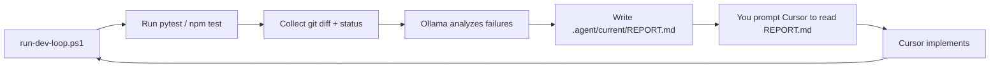

# Dev Loop — Local test → Ollama report → Cursor implements

Phase 1 of the home-model / Cursor split: **Ollama tests and writes a report file; you prompt Cursor to read it.**

Phase 2 (later): Cursor SDK automates the handoff. Phase 3 (later): Jarvis voice integration.

---

## Quick start

1. Ensure Ollama is running and the coder model is pulled:
   ```powershell
   ollama pull qwen2.5-coder:14b
   ```

2. Run the loop (installs `pytest` into the voice venv on first run):
   ```powershell
   cd C:\Users\marce\Documents\Programming\ai-assistant
   .\run-dev-loop.ps1 -Demo
   ```

3. Open Cursor Agent on this repo and paste:
   ```
   Read .agent/current/REPORT.md and implement the fixes described there.
   ```

4. Re-run `.\run-dev-loop.ps1 -Demo` to verify the fix.

---

## What it does



| Step | Who | Output |
|------|-----|--------|
| Run tests | Script | stdout/stderr |
| Analyze | Ollama (`qwen2.5-coder:14b`) | structured task |
| Report | Script | `.agent/current/REPORT.md` |
| Implement | Cursor (manual prompt) | code edits |
| Verify | Script again | pass / fail |

---

## Configuration

Edit `dev_loop/config.yaml`:

| Key | Default | Purpose |
|-----|---------|---------|
| `ollama.url` | `http://127.0.0.1:11434` | Ollama API |
| `ollama.model` | `qwen2.5-coder:14b` | Analysis model |
| `defaults.test_cmd` | auto-detect | Override test command |
| `output.dir` | `.agent/current` | Report location |

Environment overrides: `DEV_LOOP_OLLAMA_URL`, `DEV_LOOP_OLLAMA_MODEL`.

---

## CLI

```powershell
# From repo root (via helper)
.\run-dev-loop.ps1 [options]

# Or directly
voice\.venv\Scripts\python.exe -m dev_loop [options]
```

| Flag | Description |
|------|-------------|
| `--demo` | Use `dev_loop/demo` (failing sample test) |
| `--project PATH` | Target repo root |
| `--test-cmd CMD` | e.g. `pytest -q`, `npm test` |
| `--skip-tests` | Git-only analysis |
| `--note TEXT` | Extra context for Ollama |
| `--no-ollama` | Skip analysis; raw output only |
| `-v` | Debug logging |

Exit codes: `0` = tests passed or skipped, `2` = tests failed (report still written).

---

## Testing another project

```powershell
.\run-dev-loop.ps1 -Project C:\Users\marce\my-app -TestCmd "pytest -q"
```

Reports land in `<project>/.agent/current/` (not necessarily this repo).

---

## Cursor prompt templates

**After a failing run:**
```
Read .agent/current/REPORT.md and implement the fixes described there.
Keep changes minimal and match the acceptance criteria.
```

**After Cursor edits:**
```
Re-run is on me — I'll run run-dev-loop.ps1 again.
```

**With extra focus:**
```
Read .agent/current/REPORT.md. Only fix the auth redirect issue; don't refactor unrelated code.
```

---

## Files written each run

| File | Purpose |
|------|---------|
| `REPORT.md` | Human + Cursor-readable implementation brief |
| `task.json` | Machine-readable full payload |
| `test-output.txt` | Raw test log |
| `status.json` | `ready_for_cursor`, pass/fail flag |

Previous runs are archived under `.agent/history/<timestamp>/`.

---

## Next phases

- **Phase 2:** `cursor-sdk` orchestrator reads/writes the same `.agent/` protocol automatically.
- **Phase 3:** Jarvis voice command: *"run the dev loop on ai-assistant"*.
